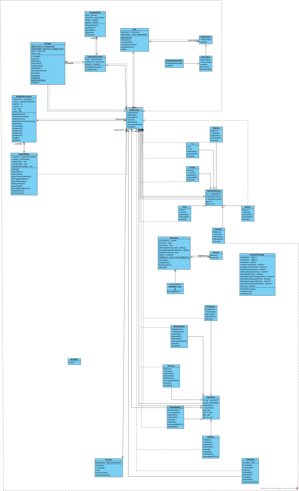

# CppCalculator

Ce projet est une application de calculatrice graphique 2D/3D développée en C++ avec le framework Qt.

## Environnement de développement

- Qt 6.6.2
- Qt Creator 13.0.0
- MinGW 11.2.0 (fourni par Qt)

## Diagramme de classes

Le diagramme de classes suivant illustre la structure de l'application :

## Fonctionnalités

- Calculatrice : Permet d'effectuer des opérations mathématiques de base.
- Graphique 2D : Affiche une représentation graphique 2D des expressions mathématiques.
- Graphique 3D : Affiche une représentation graphique 3D des expressions mathématiques.
- Console : Permet d'entrer une expression par la console.
- Sauvegarde : Permet de sauvegarder les expressions dans un fichier texte.
- Variables : Permet de définir des variables et de les utiliser dans les expressions.

## Contribution

Les contributions sont les bienvenues.